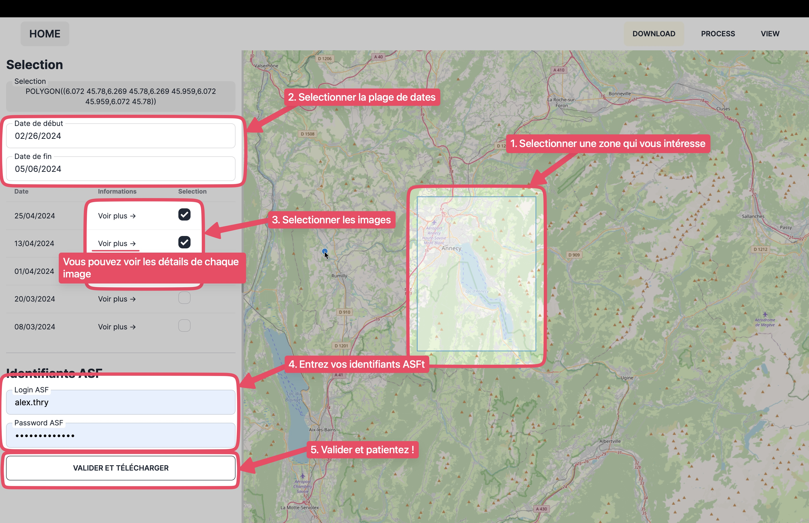
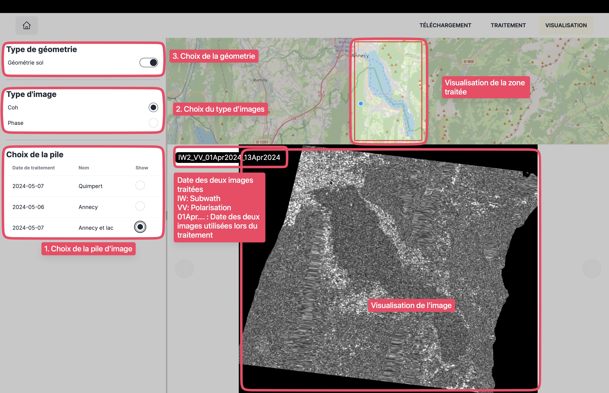

# Comment utiliser cette application

Avant toute chose, veuillez rentrer le chemin vers votre executable GTP .

Cette app est divisée en 3 parties: 
    
- Téléchargement
- Traitement
- Visualisation

## Téléchargement

Cette section simplifie le téléchargement d'images en permettant un selection simple des images souhaitées.
Il suffit de faire sa séléction sur la carte et de choisir les dates, puis de choisir les images à télécharger.
Pour chaque image, on peut visualiser toutes les informations qui lui sont liées en cliquant sur "voir plus ->".

Pour télécharger les images, il faut posséder un compte ASF et rentrer ses identifiants.

## Traitement

Dans cette partie, on peut voir quelles images ont étées téléchargées et on peut effectuer un traitement sur ces images.
Le traitement consiste pour l'instant seulement à un traitement des phases, mais pourrait étofé dans le futur.

## Visualisation

Avec ce module vous pourrez afficher les images qui sont déja traitées. Vous pourrez choisir de les affichées en géomètrie sol et quelle bandes de l'interférogramme à affichée.

